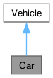

# Car Class Reference {#_class_car}

Car

The class [Car](#_class_car) inherits from [Vehicle](#_class_vehicle).

`#include <Car.h>`

Inheritance diagram for Car:

{width="50%"}

Collaboration diagram for Car:

{width="50%"}

## Public Attributes {.unnumbered}

-   []{#_class_car_1a244c8326d7bd50d3aa90d30a45e69e91}string **model** =
    \"Mustang\"

Public Attributes inherited from

Vehicle

-   string **brand** = \"Ford\"

## Additional Inherited Members {.unnumbered}

Static Public Member Functions inherited from

Vehicle

-   static void **honk** ()

## Detailed Description

The class [Car](#_class_car) inherits from [Vehicle](#_class_vehicle).

The documentation for this class was generated from the following file:

include/Car.h
