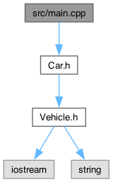

# src/main.cpp File Reference {#_main_8cpp}

src/main.cpp

The [main.cpp](#_main_8cpp) file contains the entry point of the
program.

    #include "Car.h"

Include dependency graph for main.cpp:

{width="50%"}

## Functions {.unnumbered}

-   []{#_main_8cpp_1ae66f6b31b5ad750f1fe042a706a4e3d4}int **main** ()

## Detailed Description

The [main.cpp](#_main_8cpp) file contains the entry point of the
program.

!
